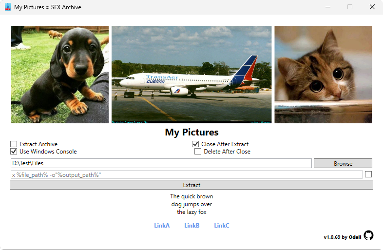

# Custom GUI SFX - [Download Latest Release [951 KB]](https://github.com/odell0111/custom-gui-sfx/releases/download/latest/CustomGuiSfx-win64-n6.0-fd.zip)
Custom GUI SFX is a free and open source Windows tool to wrap an archive file with a size of ~4GB or less in a Windows executable along with custom information, some links, and images, so you will be able to share your files in a more beautiful and personalized way, in addition, you won't need to have any tool installed to unzip the archives because this program makes use of 7-Zip internally (www.7-zip.org)

## Screenshots
  
  
  
  

## YouTube Video Tutorial
[Custom GUI SFX - Share your files in a more beautiful and personalized way](https://www.youtube.com/watch?v=)

## Why does the archive size have to be ~4GB or less?
I mention the archive because it might be the largest file, but precisely the one that cannot be equal to or larger than 4GB is the final executable, the SFX…

(...)[The executable "image" (the code/data as loaded in memory) of a Win64 file is limited in size to 2GB. This is because the AMD64/EM64T processors use relative addressing for most instructions, and the relative address is kept in a dword. A dword is only capable of holding a relative value of ±2GB](http://www.godevtool.com/GoasmHelp/64bits.htm#diffe)(...)
...a signed dword has a range of 2,147,483,647 and an unsigned dword has a range of 4,294,967,295 [4GB - 1B].

So, when you merge all of your source files (the archive, display images, and the configuration file) with the program executable, make sure that the final size of the executable is less than 4GB. This applies if you are creating your SFX from the command line. If you are creating it from the program, via the Send To context menu, an error will pop up and the SFX will not be created.

## Creating a Custom Graphical Self-Extracting archive
You have two ways of doing this.

The easiest one is to install the program and send the source files to the program as arguments via the Send To context menu, as shown in the [YouTube video tutorial](https://www.youtube.com/watch?v=).

The other one is to use command line utilities such as cat for Unix systems or copy for Windows.

- Example using cat: 
	cat CustomGuiSfx.exe config.txt FirstDisplayImage.gif SecondDisplayImage.png MyArchive.7z > MySFX.exe
	
- Example using copy: 
	copy /b CustomGuiSfx.exe + config.txt + MyArchive.7z MySFX.exe

When merging with any command line utility or any other method, keep in mind that:
* CustomGuiSfx.exe must be the first file to merge
* config.txt file must be the second one
* Display images, if any, must be the third one
* The archive file must be the last file to merge

## About the configuration file
The configuration file is the text file used to customize the SFX. If this file is not passed when creating the SFX via Send To context menu, the program will create a default one. However, if you are creating the SFX through command line utilities or any other method and forget to merge this file with the main executable, the SFX will throw an error when opening.

To create a configuration template, open the File Explorer Context Menu and click on New Configuration Template. This action will generate a config.txt template file that will automatically open in your default text editor.

As of the latest release, the configuration file size must be less than or equal to 5KB.

About configuration file entries:
* Any Link entry without its label entry will be ignored
* To ignore an entry remove the = sign or set no value
* FileToExecute requires a relative path to the file that you want to run after the extraction is done. The relative path should be based on the extraction path
* Comment entry must be always the last entry

## Notes for developers
Publish the project with the 'PublishProfile.pubxml' profile to get a single file, make sure to increase the project version.
